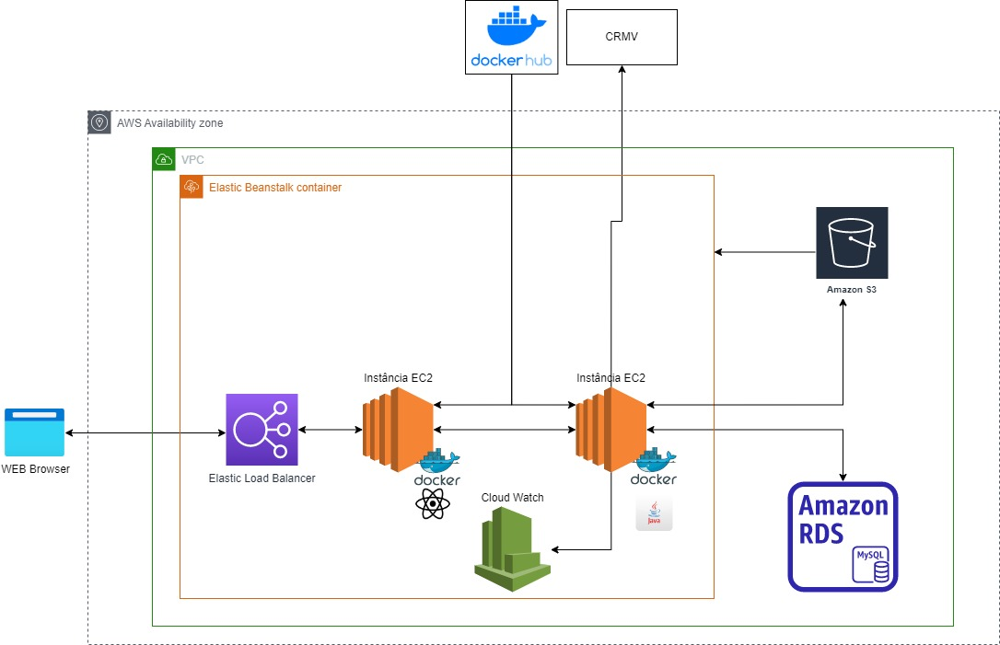

# Arquitetura

A aplicação está hospedada na infra estrutura da provedora de núvem pública AWS. A provedora fornece todos os recursos computacionais e serviços necessários para que a solução seja executada, além de prover VPC (Virtual Private Cloud), que atua como rede interna e Security Groups, que atua como firewall.

O sistema foi desenvolvido com base no modelo de arquitetura cliente-servidor, empregando a abordagem de divisão em camadas back end e front end como desacoplamento.

O cliente, ao fazer uma requisição ao nosso endereço web, recebe a aplicação de front end que está hospedada no container da aplicação React da respectiva instância EC2, que permitirá que seja processada pelo próprio navegador.

Por meio da interface web, as diversas intâncias dos clientes fazem requisições ao servidor, utilizando o padrão REST APIs(Reprentational State Application Programming Interface).
Assim, o servidor presente na instância EC2 que roda o container da aplicação Java Spring boot fica responsável por resolver as regras de negócio e comunicar seus resultados entre as demais camadas.

Como parte da integração com terceiros, a aplicação de back end prevê realizar requisições ao servidor externo de domínio da entidade de classe CRMV.

O serviço Elastic Load Balancing tem como responsabilidade distribuir o tráfego de dentro e fora da VPC entre as possíveis instâncias EC2 que processam as requisições da aplicação e seus clientes, em caso de escalonamento vertical ou horizontal da aplicação.

Para que seja possível armazenar os logs da aplicação, o back end está ao serviço CloudWatch Logs. Este serviço permitir que os logs da aplicação possam ser monitorados de fora do servidor de instalação da aplicação.

O serviço é provisionado pelo serviço AWS Elastic BeanStalk, que abstrai o processo de requisição e reserva de recursos de infraestrutura que implementa da aplicação.

O banco de dados relacional responsável pelo armazenamento dos dados da aplicação é o MySQL provido pelo AWS RDS, serviço gerenciado que persiste os estados gerados pela lógica de negócio de forma abstraída, enquanto, para o armazenamento de arquivos estáticos da aplicação, como os documentos gerados pela aplicação CertVet, fora utilizado o armazenamento de objetos Amazon S3 como banco de dados não relacional.

Para armazenamento das imagens da solução, está previsto o serviço da provedora docker, mas não é restrito a este provedor.

A arquitetura do sistema pode ser vista mais detalhadamente na figura abaixo.

