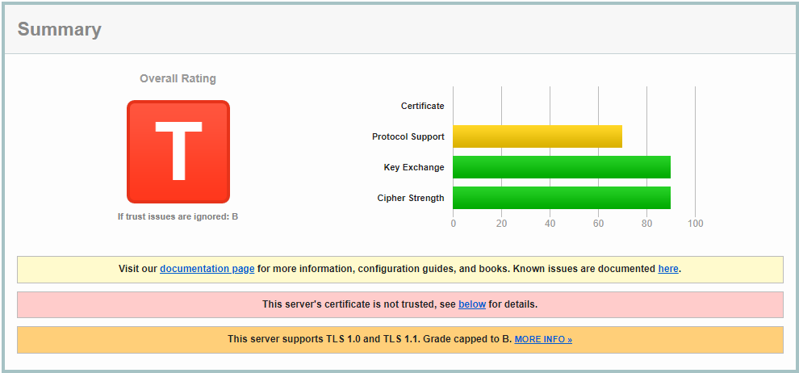
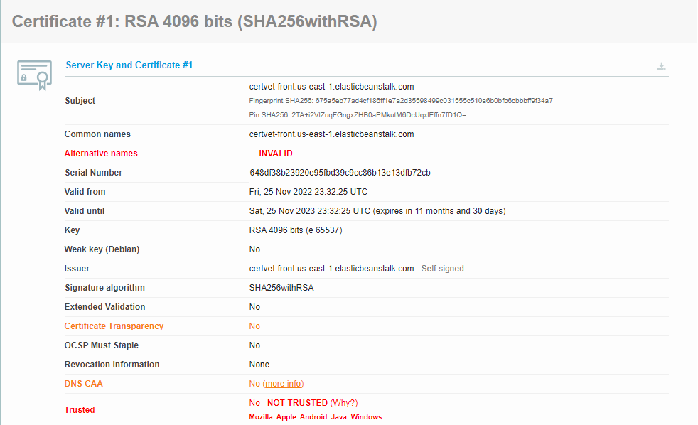
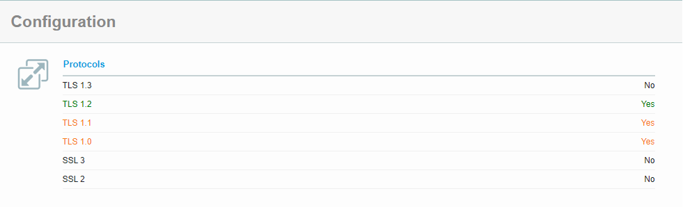
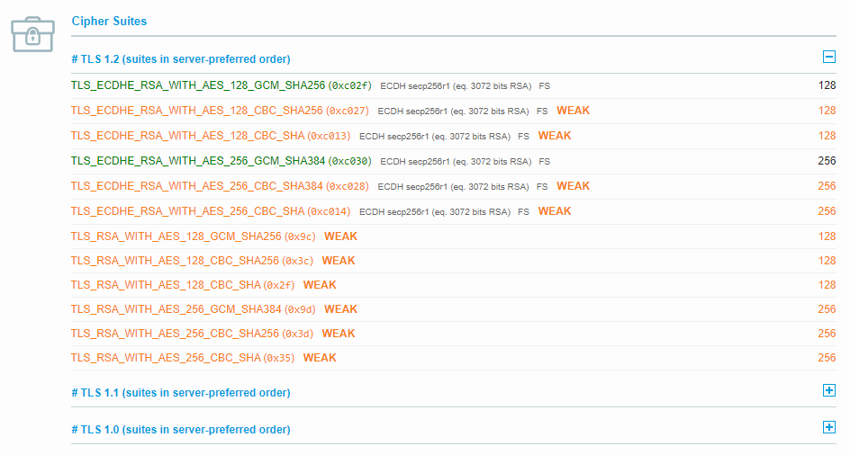

# Implementação

## Preâmbulo

Conforme exigência da disciplina documentada no conteúdo extra disponibilizado pelo professor do instituto Ivan, é necessário que sejam implementados métodos de segurança na comunicação da aplicação. Parte importante da implementação é o uso do protocolo HTTPS e políticas de segurança que também usam a comunicação HTTP como base.

O protocolo HTTPS é um protocolo exclusivo que combina SSL e HTTP. O emprego do protocolo em documentos html especifica ao cliente ou servidor que o link que será referido está protegido pelo protocolo SSL durante o interâmbio de informações. Por padrão, a comunicação ocorre a partir da porta 443, permitindo concorrência de conexão com outras portas que utilizam o protocolo HTTP, como a porta 80.

Empresas implementam suas próprias versões de servidores de internet que dão suporte ao protocolo, como a IBM [IBM HTTP Server](https://www.ibm.com/docs/pt-br/ibm-http-server/9.0.5?topic=communications-secure-sockets-layer-ssl-protocol) ou a Microsoft com o servidor [IIS](https://learn.microsoft.com/en-us/iis/configuration/).

Como referência de confiabilidade do certificado de segurança da aplicação, foi orientada a utilização do site [ssllabs](https://www.ssllabs.com/ssltest/index.html).

O site é um esforço de pesquisa sem fins lucrativos de pessoas e entidades interessadas no desenvolvimento do SSL. Se declara um arcabolço de documentos, ferramentas e reflexões relacionadas ao Secure Socket Layer (SSL) com o objetivo de tentar melhorar o entendimento de como o SSL é entregue (deployed) e como melhora-lo.

## Teste inicial

Antes de realizar qualquer tentativa de implementação, foi realizado um teste com a aplicação no estado atual (as is). Posteriormente, para documentar a situação, foi realizada uma nova consulta adicionada ao apêndice ([documento](./SSL%20Server%20Test_%20frontend-certvet.us-east-1.elasticbeanstalk.com%20(Powered%20by%20Qualys%20SSL%20Labs).pdf)).

Como a porta 443 do servidor não estava liberada nem nas regras de ingresso de requisições (inbound rules), nem tinha um certificado SSL associado, a requisição era bloqueada pela própria provedora de nuvem, antes de qualquer outra trativa ser tomada. 

## Análise de implementações possíveis

Entre as possibilidades de implementação do protocolo identificadas, foram identificadas as seguintes possibilidades:

- Associação de certificados diretamente no servidor web contido em cada container da aplicação
- Associação de certificados seguindo a documentação recomendada da provedora de serviços de nuvem [aws](https://docs.aws.amazon.com/pt_br/elasticbeanstalk/latest/dg/configuring-https.html), em que se aplica a configuração na máquina virtual criada para gerenciar o recurso.

## Tentativas de implementação

Ambas as abordagens são similares, portanto, inicialmente foi tentada a abordagem de orquestração de containeres. 

### Tentativa 1

Na abordagem da primeira tentativa, foi identificada a imagem [http-portal](https://github.com/SteveLTN/https-portal), disponibilizada publicamente no repositório de imagens docker hub e de licença MIT, com código publicado no repositório [github](https://github.com/SteveLTN/https-portal).

A imagem utiliza um servidor nginx e permite emissão de certificado de segurança Let's Encrypt a partir de uma imagem docker. A configuração a partir de um arquivo docker-compose é simples, sendo necessário apenas apontar o domínio que receberá o certificado.

Teste em ambiente local demonstraram que tal abordagem utiliza um certificado auto assinado, emitindo um certificado de segurança https nas requisições.

Entretanto, ao passar o arquivo docker-compose para o ambiente do serviço gerenciado Elasticbeanstalk, as requisições não eram passadas para a imagem que contém a aplicação de front-end. Conforme verificado nos logs da aplicação, o serviço gerenciado repassava as requisições sempre para o container de entrada, que não deveria receber requisições na porta 80.

A situação foi a mesma identificada ao realizar a tentativa de orquestração interna de containeres para as aplicações de front end e back end. Portanto, a abordagem não teve sucesso.

### Tentativas na provedora de nuvem

A partir da leitura da documentação da provedora de nuvem. Para executar esse passo, foi necessário criar um certificado auto assinado que foi utilizado em todas as etapas.

O certificado foi gerado a partir da aplicação Linux openssl, declarado na documentação da provedora de serviços. O certificado foi gerado utilizando o algoritmo RSA 4096 e armazenado no serviço de gerenciamento de senhas da provedora, que será utilizado nas tentativas subsequentes

### Tentativa 2

Entre as abordagens publicadas pela provedora, foram identificadas as possibilidades de implementação através da implementação diretamente na instância que gerencia o container da aplicação.

Essa abordagem descreve a criação de diretórios .ebextensions e .platform, bem como instrui a criação de arquivos que contém as chaves públicas e privadas entre os arquivos da aplicação que será containerizada.

Nesse passo, identificamos riscos para a aplicação por associar certificados estáticamente em arquivos da aplicação, além de aumentar o acoplamento à plataforma de nuvem, pois as configurações são empregadas apenas por essa provedora.

Outro passo necessário é a inclusão da porta 443, recebendo o protocolo HTTPS no grupo de segurança.

Considerando o risco e a possível complexidade, será priorizada a próxima abordagem.

### Tentantiva 3

Considerando a abordagem empregando o balanceador de carga (load balancer), verificou-se maior simplicidade no processo de configuração do protocolo, sendo reproduzido com a mesma praticidade para ambos os ambientes da aplicação.

A abordagem suporta tanto a implementação adicionando arquivos e diretórios na aplicação quanto alteração manual na interface de console.

Embora existam mais passos não automatizados, utilizar o console permite que dados que não desejamos que sejam publicados sejam mantidos privados.

Após a configuração do processo, foi possível realizar a configuração do protocolo HTTPS, estando disponível para análise das ferramentas apontadas na referência da disciplina.

## Avaliação de segurança do protocolo

Ao executar a ferramenta, recebemos a nota [T](./SSL%20Server%20Test_%20certvet-front.us-east-1.elasticbeanstalk.com%20(Powered%20by%20Qualys%20SSL%20Labs).pdf), tendo as seguintes avaliações:

- Certificate: 0%
- Protocol Support: 70%
- Key Exchange: 90%
- Cipher Strength: 90%

Consultando a [referência](https://github.com/ssllabs/research/wiki/SSL-Server-Rating-Guide) publicada na ferramenta sobre o método de graduação da aplicação, a nota T constata que existe um certificado auto assinado e que não está presente em nenhuma cadeia de certificado declarada na cadeia de certificação, portanto, não é possível atestar que seja um certificado de uma fonte válida.

Assim, será considerada a avaliação que ignora problemas de confiabilidade (trust). Nesse escopo, a nota obtida foi B.

Com base no objetivo apontado pela refrência do professor Ivan, buscando alcançar a nota A e prosseguimos com a análise dos criterios de avaliação publicado pela ferramenta.

### Avaliação do quesito certificado (Certificate)

Para que o critério de avaliação seja melhorado, é necessário que o domínio declarado no certificado seja o mesmo do domínio acessado e que seja adicionado à cadeia de confiança de uma das autoridades de certificação (CA).
Atualmente, não é possível cumprir com esse quesito por acarretar em custos não previstos para o momento.

### Suporte a protocolos (Protocol Support)

Segundo o método de avaliação, as regras tendem a reduzir as notas conforme critérios sejam cumpridos ou não. A aplicação não suporta protocolos TLS 1.3, SSL 2 e SSL 3, bem como apresenta limitações de suporte a  por se tratar de uma implementação da provedora AWS.

### Suporte a Cifras (Cipher Suites)

